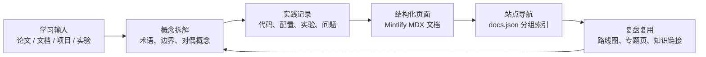

<div align="center">

<h1>vectorpeak-blogs | VectorPeak 技术知识花园</h1>

<p><strong>Agent-first Personal Blog & Knowledge Site</strong></p>

<p>
  
  
  
  
  
</p>

<p><strong>简体中文</strong> · <a href="#in-english">English</a></p>

</div>

`vectorpeak-blogs` 是 VectorPeak 的个人技术博客与知识站点。它不是一个只负责展示页面的文档模板，而是一个持续生长的 **knowledge garden**：把 Agent、RAG、算法、深度学习和阶段性思考，整理成可检索、可复盘、可迭代的公开知识资产。

项目的核心目标是：让零散学习笔记从“临时记录”升级为“可长期复用的知识系统”。如果把普通博客比作一排文章橱窗，那么这个仓库更像一座技术温室：不同主题分区生长，但都服务于同一件事——沉淀清晰的问题、路径、概念和实践证据。

## 当前阶段

当前仓库已经具备一个可运行的 Mintlify 知识站点骨架，并围绕 Agent、RAG、LeetCode、DeepLearning 等方向形成内容分区。README 的定位是帮助读者快速理解：这个站点写什么、如何组织、如何本地预览，以及未来如何持续维护。

当前内容边界如下：

- **Guides**：站点说明、写作入口、阶段性反思与通用笔记。
- **Agent**：Agent 理论、框架生态、LangChain、LangGraph、MCP、多智能体与现代 Coding Agent 观察。
- **RAG**：从检索基础、切分、Embedding、Milvus、重排，到生产化、评估和 Agentic RAG 的系统化笔记。
- **LeetCode**：算法路线图、题目整理、解题方法与长期训练记录。
- **DeepLearning**：深度学习相关学习记录、实验实践和接口示例。
- **mint-skills / tools / src**：用于站点内容生产、自动化检查或辅助构建的本地工程化支持。

仓库当前已经具备：

- `docs.json` 驱动的 Mintlify 站点配置。
- `index.mdx` 作为站点首页入口。
- 多主题内容目录：`Agent/`、`RAG/`、`LeetCode/`、`DeepLearning/`、`Guides/`。
- 图片与静态资源目录：`images/`、`public/`。
- 站点辅助脚本与工具目录：`tools/`、`src/`、`beian-footer.js`。
- 面向协作与内容生成的 `AGENTS.md` 约束。
- MIT License。

## 内容地图

站点内容遵循 **Concept → Practice → Reflection → Reuse** 的组织思路：先解释概念，再沉淀实践路径，最后通过复盘和交叉链接把知识变成可复用资产。



从上到下看，这个站点不是按“今天写了什么”来组织，而是按“以后如何重新找到、重新理解、重新使用”来组织。

## 快速开始

安装 Mintlify CLI：

```bash
npm i -g mint
```

在项目根目录启动本地预览：

```bash
cd E:\Github\vectorpeak-blogs
mint dev
```

检查站内坏链：

```bash
mint broken-links
```

常用维护动作：

```bash
# 查看当前 Git 状态
git status --short

# 搜索某个主题关键词
rg "Agent" Agent RAG Guides LeetCode DeepLearning

# 查看站点导航配置
cat docs.json
```

## 写作约定

内容生产遵循“先框架、再细节、再证据”的原则：

- **先定义问题**：每篇笔记尽量回答“它解决什么问题，而不是只罗列资料”。
- **先搭骨架**：重要主题优先写概念边界、术语关系和学习路线，再补充细节。
- **保留上下文**：实验、踩坑、配置和结论应尽量写清触发条件，避免脱离环境后失真。
- **避免孤岛化**：新页面应尽量放入 `docs.json` 导航，必要时补充与相关主题的链接。
- **区分事实与观点**：外部文档、项目行为、个人判断和阶段性猜想应分层表达。

这里的“知识花园”不是随意堆材料，而是把材料种到正确位置。一个概念如果没有边界，就像没有标签的种子；一个实践如果没有复盘，就像只开一次花的枝条。

## 仓库说明

核心文件与目录如下：

```text
vectorpeak-blogs/
├── AGENTS.md                 # 内容协作与 Agent 写作约束
├── README.md                 # 项目入口：定位、结构、流程、本地开发
├── LICENSE                   # MIT License
├── docs.json                 # Mintlify 主配置：主题、导航、Logo、上下文工具
├── index.mdx                 # 站点首页
├── beian-footer.js           # 备案页脚等站点辅助脚本
│
├── Guides/                   # 通用说明、写作入口、阶段性反思
├── Agent/                    # Agent 理论、框架、现代 Agent 观察
├── RAG/                      # RAG 基础、检索工程、生产化、评估与高级主题
├── LeetCode/                 # 算法路线图、题解整理与训练路径
├── DeepLearning/             # 深度学习笔记、实验与实践内容
│
├── images/                   # 图片、Logo 与文档插图资源
├── public/                   # Mintlify 静态资源
├── mint-skills/              # 站点相关技能与内容生产辅助材料
├── src/                      # 本地辅助源码
└── tools/                    # 内容维护、检查或生成脚本
```

## 维护清单

新增或调整内容时，建议按下面顺序检查：

- 页面是否放在正确主题目录下。
- 页面是否已经加入 `docs.json` 导航。
- 标题、文件名和导航名是否保持一致。
- 图片或静态资源是否使用稳定路径。
- 外部概念是否补充来源、边界和反例。
- 本地是否通过 `mint dev` 预览和 `mint broken-links` 检查。
## 注意事项

这个仓库更接近一个持续演化的个人知识库，而不是一次性完成的教程合集。阅读和维护时建议注意：

- **内容仍在生长**：部分页面可能是阶段性笔记、学习草稿或后续专题的入口，不一定代表最终结论。
- **以主题目录为主线**：新增内容优先放入 `Agent/`、`RAG/`、`LeetCode/`、`DeepLearning/` 或 `Guides/`，避免在根目录堆叠零散页面。
- **导航需要同步维护**：新增页面后，应同步检查 `docs.json`，否则页面可能存在于仓库中，但不会出现在站点导航里。
- **实践内容要保留环境**：涉及代码、实验、工具链或模型调用时，应尽量写清版本、依赖、输入条件和失败边界。
- **个人判断不等于通用结论**：反思类内容会包含个人经验和阶段性判断，适合作为参考，而不是直接照搬为工程规范。
- **图片与静态资源要稳定**：文档中的图片、Logo 和附件应放在 `images/` 或 `public/` 下，并使用可长期维护的路径。

## FAQ

### 这个仓库和普通博客有什么区别？

普通博客通常按发布时间组织，更像时间线；`vectorpeak-blogs` 更偏知识库，按主题和问题组织。它关注的不是“某天写了什么”，而是“某个概念、实践或路线以后能不能被重新找到、理解和复用”。

### 为什么使用 Mintlify？

Mintlify 适合把 Markdown / MDX 内容组织成结构化文档站点：导航清晰、搜索友好、页面风格统一，也便于把学习笔记逐步沉淀成更像产品文档的知识系统。

### 新增页面后为什么站点里看不到？

大概率是页面还没有加入 `docs.json` 的导航配置。仓库中的文件只是内容实体，`docs.json` 才决定它是否出现在站点导航中。

### Agent、RAG、LeetCode、DeepLearning 之间是什么关系？

它们对应不同层次的技术能力：`LeetCode` 偏基础算法训练，`DeepLearning` 偏模型与学习方法，`RAG` 偏知识系统工程，`Agent` 偏工具调用、任务规划和自动化执行。四者不是孤立目录，而是从基础能力到 AI 工程系统的连续学习路径。

### 这个仓库适合谁阅读？

适合想系统学习 AI 工程、RAG、Agent、算法训练和深度学习实践的人阅读。对于只想复制一份博客模板的人，它也可以作为 Mintlify 站点结构参考，但重点仍然是内容组织方法，而不是页面样式本身。

### 维护这个站点时最容易出错的地方是什么？

最常见的问题有三个：新增页面但忘记更新 `docs.json`；图片路径在本地可用但线上不可用；学习笔记只记录结论，却没有记录问题背景、实验条件和失败边界。

### 本地预览失败怎么办？

先确认已经安装 Mintlify CLI，并在仓库根目录运行：

```bash
npm i -g mint
mint dev
```

如果页面能打开但导航异常，优先检查 `docs.json`；如果图片或链接异常，运行：

```bash
mint broken-links
```
