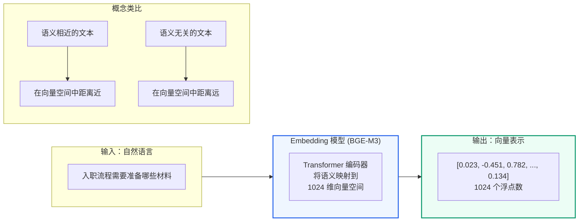
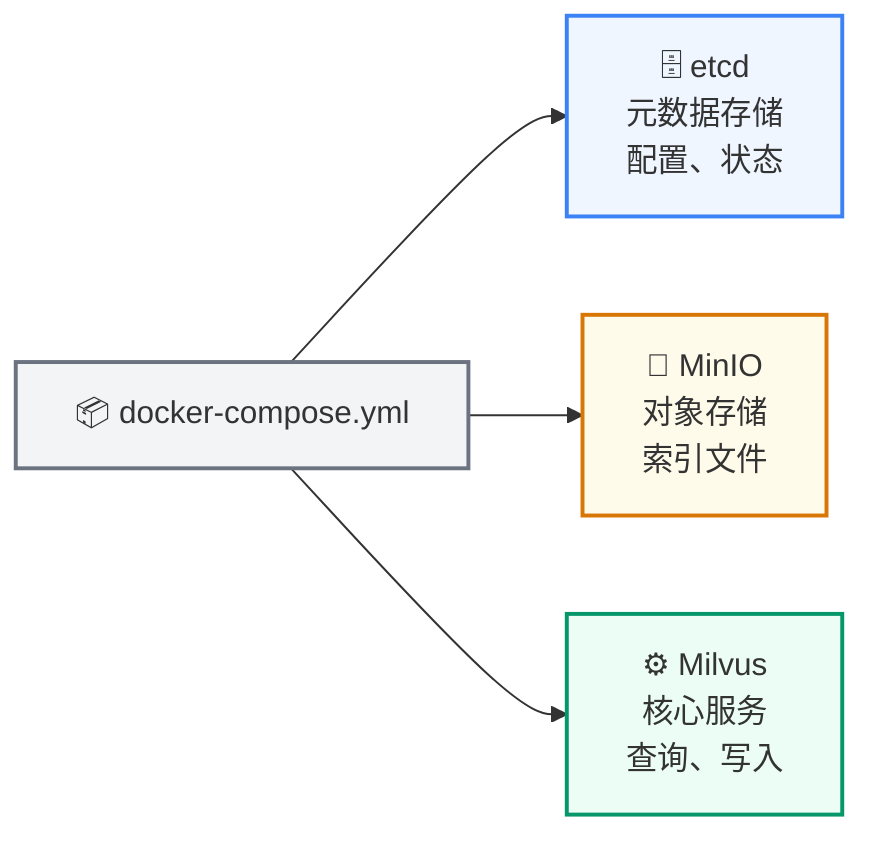
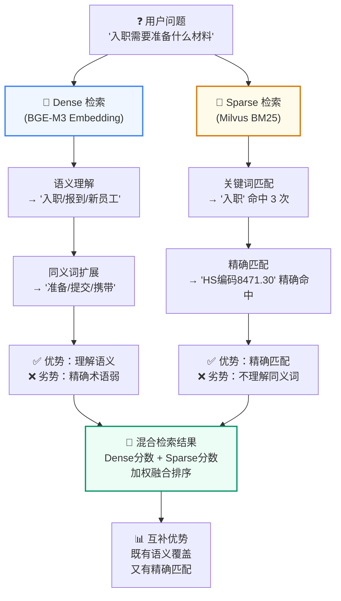
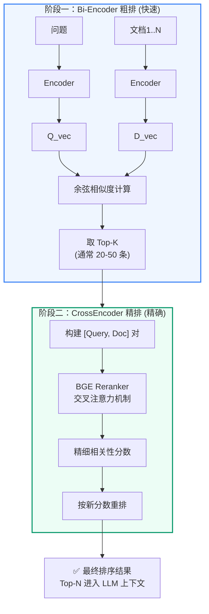
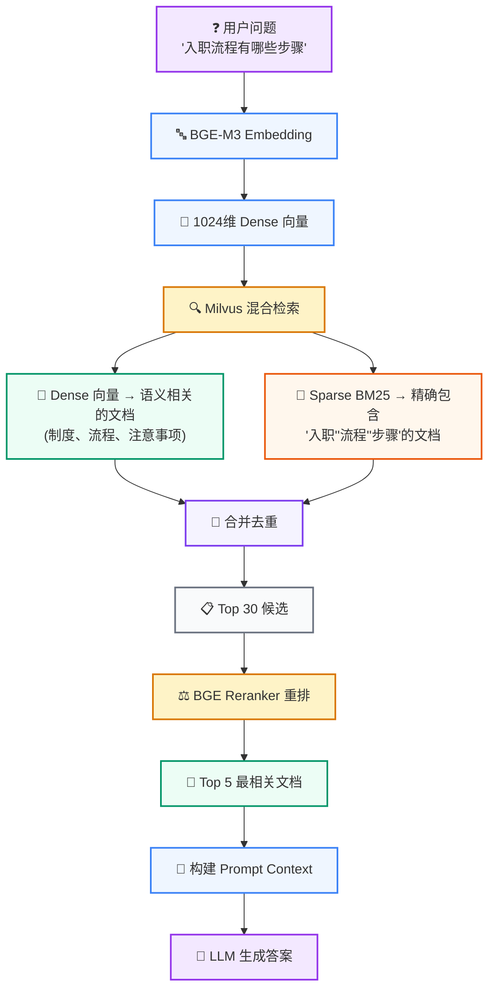

# RAG 基础

<Badge icon="clock" color="green">Written: 2026.06</Badge>
**上一讲**：[项目概述与环境搭建](/RAG/foundations/project-overview)\
**下一讲**：[LangChain 生态系统](/RAG/foundations/langchain-ecosystem)

## 1. 本讲目标

* 深入理解向量检索的数学原理
* 掌握 Embedding 模型的工作机制
* 理解 Dense 检索和 Sparse 检索的区别与互补
* 了解 Reranker(重排)在 RAG 链路中的作用

***

## 2. 前置知识 — Embedding 模型

### 2.1 什么是 Embedding

**Embedding(嵌入)** 是将非结构化数据(文本、图片、音频)转换为固定长度的浮点数向量的技术。



在文本领域，Embedding 模型接收一段文字，输出一串数字(通常是 512 到 4096 维的向量)，这个向量在数学空间中代表了这段文字的"语义位置"。

### 2.2 为什么要 Embedding

计算机本质上只能做数值计算。要让计算机"理解"两段文字是否相似，必须先把文字变成它可以计算的数字。

早期方法(如 TF-IDF、Bag-of-Words)只统计词频和共现关系，无法理解语义：

* "我很开心" 和 "我非常高兴" 的词完全不同，但语义相同
* "银行利率很高" 和 "河边的银行很美" 词相同，但语义完全不同

现代 Embedding 模型基于 Transformer 架构，通过大规模预训练学会了理解上下文中的语义。同一个词在不同上下文中会产生不同的向量表示。

### 2.3 向量相似度计算

Embedding 把文本变成向量以后，检索系统要回答一个问题：**用户问题向量和知识库中哪个 chunk 向量更接近？**

这里要先区分两个概念：

* **相似度(similarity)**：分数越大越相似，例如 Cosine、Inner Product
* **距离(distance)**：数值越小越接近，例如 Euclidean Distance

向量数据库通常会把距离或相似度统一转成“可排序的分数”。所以你在代码里看到的 `score`，不一定都严格等于数学公式原始值，而是 Milvus / LangChain 返回的检索排序分数。

#### 2.3.1 余弦相似度：看方向

**余弦相似度 (Cosine Similarity)** — 最常用

```text
\text{cosine}(A, B) = \frac{A \cdot B}{||A|| \times ||B||}
```

其中：

* `A \cdot B` 是两个向量的点积
* `||A||` 和 `||B||` 是两个向量的长度
* 分母的作用是把长度影响消掉，只比较两个向量的方向
* 取值范围 \[-1, 1]
* 1 表示方向完全一致，0 表示正交(不相关)，-1 表示方向相反
* 只看方向不看长度，适合文本语义比较

直观理解：

```text
"新人入职流程"       → 方向接近 "新员工报到步骤"       → cosine 高
"新人入职流程"       → 方向远离 "VPN 连接失败"         → cosine 低
```

#### 2.3.2 欧几里得距离：看直线距离

**欧几里得距离 (Euclidean Distance)** — 适合 L2 归一化后的向量

```text
d(A, B) = \sqrt{\sum\_{i=1}^{n}(A\_i - B\_i)^2}
```

欧氏距离比较的是两个点在向量空间中的直线距离。它是“距离”，所以：

* 数值越小，表示越相似
* 数值越大，表示越不相似

如果向量已经做过 L2 归一化，Cosine、L2、IP 的排序结果会非常接近。原因是所有向量都被压到单位球面上，长度都约等于 1，这时主要差别就来自方向。

#### 2.3.3 内积：看方向和长度的乘积

**内积 (Inner Product / Dot Product)**：

```text
IP(A, B) = \sum\_{i=1}^{n}A\_i \times B\_i
```

内积可以理解为“两个向量在同一方向上的重合程度”。如果向量没有归一化，内积会同时受方向和长度影响；如果向量已经 L2 归一化，内积和余弦相似度等价：

```text
||A|| = ||B|| = 1 \Rightarrow \text{cosine}(A, B) = A \cdot B
```

所以很多向量检索系统会使用：

* **COSINE**：语义检索中最容易解释
* **IP**：归一化后效果等价，计算更直接
* **L2**：适合一些几何距离场景

```python
import numpy as np

# 两个语义相近的句子的向量
A = np.array([0.5, 0.3, 0.8, ...])  # "入职需要什么材料"
B = np.array([0.48, 0.32, 0.79, ...])  # "入职要准备哪些文件"

cosine_sim = np.dot(A, B) / (np.linalg.norm(A) * np.linalg.norm(B))
# 结果 ≈ 0.95(很高)

# 两个语义不同的句子的向量
C = np.array([-0.3, 0.7, -0.2, ...])  # "今天天气怎么样"

cosine_sim_ac = np.dot(A, C) / (np.linalg.norm(A) * np.linalg.norm(C))
# 结果 ≈ 0.1(很低)
```

#### 2.3.4 本项目在哪里用相似度计算

本项目不是只在一个地方做“相似度计算”，而是在检索链路中分层使用：

| 使用位置            | 代码位置                                                            | 计算方式                                            | 作用                               |
| --------------- | --------------------------------------------------------------- | ----------------------------------------------- | -------------------------------- |
| Dense 向量检索      | `qa_core/retrieval/store.py` → `similarity_search_with_score()` | BGE-M3 生成 1024 维 dense 向量，Milvus 按 dense 向量字段检索 | 找到语义相近的 FAQ / 文档 chunk           |
| Dense 索引示例      | 第 4 讲 pymilvus 示例                                               | `metric_type="COSINE"`                          | 教学展示 Milvus 如何按向量相似度搜索           |
| Sparse BM25 检索  | `qa_core/retrieval/milvus_compat.py` → `BM25BuiltInFunction`    | 中文分词 + BM25 词频/逆文档频率评分                          | 找到精确包含关键词、术语、编号的内容               |
| Hybrid 融合       | `qa_core/retrieval/store.py`                                    | `ranker_type="weighted"`，权重 `[0.55, 0.45]`      | 将 dense 语义分数和 sparse BM25 分数融合排序 |
| CrossEncoder 重排 | `qa_core/retrieval/ranking.py`                                  | query + passage 成对输入 reranker 模型                | 对 Milvus 召回候选做二阶段精排              |

本项目的核心检索配置可以概括为：

```text
用户问题
  → BGE-M3 生成 dense query vector
  → Milvus BM25 Function 生成 sparse query representation
  → Milvus 同时检索 dense 字段和 sparse 字段
  → WeightedRanker 按 0.55 / 0.45 融合
  → CrossEncoder Reranker 二阶段重排
```

#### 2.3.5 Sparse 检索也是用余弦相似度吗？

**不是。至少在本项目中不是。**

Dense 检索比较的是 BGE-M3 生成的连续浮点向量，例如 1024 维：

```text
dense = [0.012, -0.034, 0.876, ...]
```

这类向量适合用 Cosine / IP / L2 这类几何相似度计算。

Sparse 检索虽然也叫“稀疏向量”，但本项目的 sparse 字段由 Milvus 的 BM25 Function 生成，核心思想不是“两个语义向量夹角有多小”，而是：

```text
query 里出现的词，是否也出现在文档里？
这个词在当前文档中出现得多不多？
这个词在整个语料库中稀不稀有？
这篇文档是不是因为太长而天然占便宜？
```

BM25 的典型形式是：

```text
\text{BM25}(D, Q) = \sum\_{i=1}^{n} \text{IDF}(q\_i) \times \frac{f(q\_i, D) \times (k\_1 + 1)}{f(q\_i, D) + k\_1 \times (1 - b + b \times \frac{|D|}{\text{avgdl}})}
```

它关注的是：

* **TF**：词在当前文档里出现多少次
* **IDF**：词在整个语料中稀不稀有，越稀有越重要
* **长度归一化**：长文档不能因为词多就天然分数高

可以这样总结：

```text
Dense 相似度：比较语义向量，常见公式是 Cosine / IP / L2。
Sparse BM25：比较关键词匹配贡献，核心是词频、逆文档频率和文档长度归一化。
Hybrid Search：不是让两者用同一个公式，而是分别计算各自分数，再融合排序。
```

### 2.4 BGE-M3 模型介绍

本项目使用的是 **BGE-M3**(BAAI General Embedding M3)，由北京智源研究院(BAAI)开发。

> 📖 **深入学习**：如果你想了解 Embedding 模型的完整工作原理(Tokenization → Transformer → Pooling → 向量输出)、维度选择、模型对比和 L2 归一化，请阅读 [附录F：Embedding 模型深入](/RAG/appendix/embedding-models)。

**BGE-M3 的核心特点**：

| 特性  | 说明                                       |
| --- | ---------------------------------------- |
| 多语言 | 支持中英双语及 100+ 语言                          |
| 多粒度 | 支持短句到长文档(最多 8192 token)的向量化              |
| 多功能 | 同时支持 Dense 检索、Sparse 检索和 Multi-Vector 检索 |
| 维度  | 默认输出 1024 维 Dense 向量                     |
| 部署  | 可在本地 GPU/CPU 上运行，不需要调用外部 API             |

在本项目中，BGE-M3 部署在 `models/bge-m3/` 目录下，通过 LangChain 的 Embedding 接口调用：

```python
# qa_core/retrieval/models.py — 获取 Embedding 模型
from langchain_huggingface import HuggingFaceEmbeddings

def get_embeddings():
    return HuggingFaceEmbeddings(
        model_name="models/bge-m3",
        model_kwargs={"device": "cpu"},  # 或 "cuda"
        encode_kwargs={"normalize_embeddings": True},  # L2 归一化
    )
```

***

## 3. 前置知识 — 向量数据库

### 3.1 为什么需要专门的向量数据库

初看可能会问：PostgreSQL 不是也有 pgvector 插件吗？为什么还要用 Milvus？

答案是**性能和规模**：

| 对比维度    | pgvector      | Milvus                    |
| ------- | ------------- | ------------------------- |
| 百万级向量检索 | 较慢(秒级)        | 毫秒级                       |
| 索引类型    | IVFFlat, HNSW | HNSW, IVF, DiskANN 等 11 种 |
| 混合检索    | 不支持           | Dense + Sparse 原生混合       |
| 分布式     | 需额外配置         | 原生支持分布式                   |
| 过滤表达式   | 基础            | 丰富的标量过滤                   |

在本项目中，每个业务场景有数千条 FAQ 和数万个文档 chunk，且需要同时进行 Dense 向量检索和 BM25 关键词检索。Milvus 的 Hybrid Search 在一个查询中同时完成这两种检索，是最合适的选择。

### 3.2 Milvus 核心概念

> **前置知识**：如果你不熟悉 HNSW 图索引原理，请先阅读 [附录C：HNSW 图索引原理](/RAG/appendix/hnsw-index)。如果你想了解 Milvus 各种索引类型的图解和 pymilvus 基本操作代码，请阅读 [第4讲：Milvus 索引机制与基本操作](/RAG/retrieval/milvus-index-and-operations)。

**Collection(集合)**：类似关系数据库中的"表"。一个 Collection 存储一组相同结构的数据。

**Field(字段)**：Collection 中的列。包括：

* 主键字段 (Primary Key)
* 向量字段 (Vector Field) — 用于相似度搜索
* 标量字段 (Scalar Field) — 用于过滤(如 source, kb\_version)

**Index(索引)**：加速向量检索的数据结构。Milvus 支持多种索引类型：

* HNSW：基于图的索引，适合高召回率场景
* IVF\_FLAT：基于聚类的索引，内存占用小
* 本项目使用默认的 HNSW 索引

**Partition(分区)**：Collection 的物理分片，用于提高查询效率。

### 3.3 Milvus 的部署架构



* **etcd**：分布式键值存储，Milvus 用它存储元数据(Collection 定义、索引状态、节点信息)
* **MinIO**：S3 兼容的对象存储，Milvus 用它存储向量索引文件、日志和 binlog
* **Milvus Standalone**：核心引擎，处理向量写入、索引构建和相似度搜索

***

## 4. Dense 检索 vs Sparse 检索

这是本项目最核心的检索概念。让我们用一个具体的例子来理解。



### 4.1 场景设定

假设知识库中有以下文档片段：

| ID | 内容                           |
| -- | ---------------------------- |
| D1 | "忘记密码时，可以通过绑定的邮箱或手机号自助重置"    |
| D2 | "管理员可以在后台重置任何用户的密码"          |
| D3 | "Webhook 回调地址配置在系统设置-集成管理页面" |
| D4 | "API 密钥在个人设置-安全页面中生成和管理"     |

### 4.2 Dense 检索(语义相似度)

用户提问：**"我怎么修改自己的登录密码"**

Dense 检索使用 Embedding 模型将问题和文档都转成向量，计算余弦相似度：

```text
问题向量   vs  D1 向量 → 相似度 0.91  ← 最高！语义非常接近
问题向量   vs  D2 向量 → 相似度 0.72
问题向量   vs  D3 向量 → 相似度 0.15
问题向量   vs  D4 向量 → 相似度 0.22
```

D1 排第一，因为"忘记密码→自助重置"与"修改登录密码"语义高度相关。

**Dense 检索的优势**：

* 理解语义，同义词和改写都能识别
* "重置密码"、"修改密码"、"改密码"、"忘记密码怎么办"等表达都能召回

**Dense 检索的局限**：

* 对专业术语、编号、代码等精确匹配较弱
* 例如搜索"API v3.2 变更"，Dense 检索可能召回所有和 API 相关的文档，难以精确定位到特定版本

### 4.3 Sparse 检索(关键词匹配)

Sparse 检索(本项目使用 BM25 算法)基于词频和逆文档频率，对关键词做精确匹配：

```text
问题："API 密钥在个人设置-安全页面中生成和管理"

D4 包含：API(1次), 密钥(1次), 个人设置(1次), 安全页面(1次), 生成(1次), 管理(1次)
→ BM25 分数最高

D3 包含：Webhook(1次), 回调(1次), API(0次), 密钥(0次)
→ BM25 分数较低
```

**Sparse 检索的优势**：

* 精确匹配专业术语、编号(如 "API v3.2"、"HS 编码 8471.30")
* 对生僻词和专有名词效果极好
* 计算效率高，不需要 GPU

**Sparse 检索的局限**：

* 无法理解语义：搜"修改密码"不会召回"忘记密码怎么办"
* 同义词需要手动维护

### 4.4 Hybrid Search(混合检索)

**混合检索 = Dense + Sparse**，取长补短：

```text
问题："HS 编码 8471.30 的进口关税是多少"

Dense 检索贡献：
  → 召回语义相关的文档：关税政策、进口流程、税率表

Sparse 检索贡献：
  → 精确匹配 "8471.30" 的文档：该编码对应的具体税率记录

合并结果 → 既有精确的编码匹配，又有相关的背景信息
```

在本项目中，Milvus 2.5.x 原生支持混合检索，并通过 BM25BuiltInFunction 提供 Sparse 召回能力：

```text
# 一次查询同时走 Dense 向量和 Sparse 向量
results = milvus_store.similarity_search_with_score(
    query,
    k=top_k,
    expr=filter_expression,  # 同时过滤 source、kb_version、tenant 等
)
# Milvus 内部自动融合 Dense 和 Sparse 的分数
```

***

## 5. Reranker(重排器)



### 5.1 为什么需要重排

Embedding 模型的检索是**双塔架构**(Bi-Encoder)：问题和文档分别编码为向量，然后计算相似度。

```text
双塔架构(检索阶段)：
  问题 → Encoder → Q_vec ─┐
                            ├→ 余弦相似度 → 分数
  文档 → Encoder → D_vec ─┘

优点：速度快，可以预先计算所有文档的向量
缺点：问题和文档之间没有交叉注意力，精度有限
```

**Reranker 使用 CrossEncoder 架构**(交叉编码器)：将问题和文档拼接后一起编码，通过交叉注意力机制获得更精确的相关性判断。

```text
交叉编码器(重排阶段)：
  [问题 + 文档] → CrossEncoder → 相关性分数

优点：精度高，能捕捉细粒度的相关性
缺点：计算量大，不能对所有文档都做(所以只对检索结果的 Top-K 做)
```

### 5.2 Reranker 的工作流程

```python
# qa_core/retrieval/ranking.py — 简化的重排逻辑

def rerank_hits(query, hits, *, reranker, top_n):
    """
    hits: Milvus 召回的候选文档(通常 20-50 个)
    reranker: BGE Reranker Large 模型
    """
    # 构建 [query, document] 对
    pairs = [[query, hit.page_content] for hit in hits]

    # CrossEncoder 逐一打分
    scores = reranker.predict(pairs)

    # 按新分数重新排序
    for hit, score in zip(hits, scores):
        hit.score = float(score)

    return sorted(hits, key=lambda h: h.score, reverse=True)
```

**具体例子**：

```text
用户问题："入职时需要提交哪些材料"

Milvus 召回 Top-20：
  1. "入职流程包括提交材料、签订合同..." (dense:0.82, sparse:0.45)
  2. "离职需要提交离职申请表..." (dense:0.78, sparse:0.30)  ← 语义相近但答非所问
  3. "入职当天要携带身份证复印件..." (dense:0.75, sparse:0.55)
  ...

经过 BGE Reranker 重排：
  1. "入职当天要携带身份证复印件、学历证明..." (rerank: 0.94) ↑
  2. "入职流程包括提交材料、签订合同..." (rerank: 0.91) ↓
  3. "离职需要提交离职申请表..." (rerank: 0.15) ↓↓ 被排到后面
  ...
```

Reranker 准确识别出"离职"和"入职"是不同的场景，将相关但错误的文档排到了后面。

### 5.3 BGE Reranker Large

本项目使用 **BGE Reranker Large**(同样是 BAAI 开发)，与 BGE-M3 Embedding 模型配合使用：

* 架构：CrossEncoder(XLM-RoBERTa 基座)
* 输入：`[CLS] query [SEP] document [SEP]`
* 输出：0-1 之间的相关性分数
* 部署：本地运行，位于 `models/bge-reranker-large/`

***

## 6. 在本项目中的体现

回顾第 1 讲中的核心架构图，现在你应该能理解每个组件的角色：



***

## 7. 本讲实践闭环

| 项目       | 内容                                      |
| -------- | --------------------------------------- |
| 本讲类型     | 原理实验                                    |
| 实践产物     | Embedding 相似度、BM25、Reranker 的单点实验       |
| 是否进入最终项目 | 否，作为理解检索原理的 demo；模型加载逻辑会进入项目            |
| 验收方式     | 运行 demo 后，相似问题分数更高，Reranker 能把更相关文本排到前面 |
| 后续落点     | 第 8 讲落到 Hybrid Search，第 17 讲落到检索评测      |

通过标准：能解释 Dense、Sparse、Reranker 各自解决什么问题，以及为什么要组合使用。

## 8. 重点掌握

| 优先级    | 内容                                                 | 原因                              |
| ------ | -------------------------------------------------- | ------------------------------- |
| ★★★ 必会 | Embedding 的概念：文本→固定长度浮点数向量，语义相近的文本向量距离近            | 向量检索的基石，面试必问                    |
| ★★★ 必会 | Dense 检索(语义相似度)vs Sparse 检索(关键词 BM25)的区别和互补        | 混合检索策略的核心，决定召回质量                |
| ★★★ 必会 | Hybrid Search = Dense + Sparse 取长补短                | 本项目 Milvus 的核心检索方式              |
| ★★★ 必会 | Reranker(CrossEncoder)解决 Bi-Encoder 精度不足的问题：先粗排后精排 | 提升检索精度的关键环节，面试高频                |
| ★★ 理解  | 余弦相似度的取值范围和含义                                      | 理解向量比较的基础                       |
| ★★ 理解  | BGE-M3 的多语言、多粒度、多功能特性                              | 了解本项目 Embedding 模型的选择理由         |
| ★★ 理解  | Milvus 核心概念：Collection、Field、Index、Partition       | 为第 4 讲 Milvus 索引机制与第 8 讲混合检索做铺垫 |
| ★ 了解   | 向量相似度的三种计算方式(余弦/欧氏/内积)的公式                          | 面试可能问到，但项目中使用默认内积               |
| ★ 了解   | pgvector vs Milvus 的对比                             | 了解选型理由即可                        |

## 9. 本讲小结

* Embedding 模型将文本转换为语义向量，语义相近的文本在向量空间中距离也近
* BGE-M3 是本项目使用的多语言 Embedding 模型，支持 Dense + Sparse 双向量输出
* Milvus 向量数据库不同于传统数据库，专为十亿级向量的高效相似度搜索设计
* Dense 检索(语义)和 Sparse 检索(关键词)各有所长，混合检索取长补短
* Reranker(CrossEncoder)对检索结果做精排，将问题和文档联合编码获得更精确的相关性
* 完整的检索链路是：Embedding → 混合检索 → 去重 → Reranker → 上下文筛选

**下一讲**：[LangChain 生态系统](/RAG/foundations/langchain-ecosystem) — 模型调用、消息历史、Prompt、文档对象、切分器和 VectorStore 抽象
