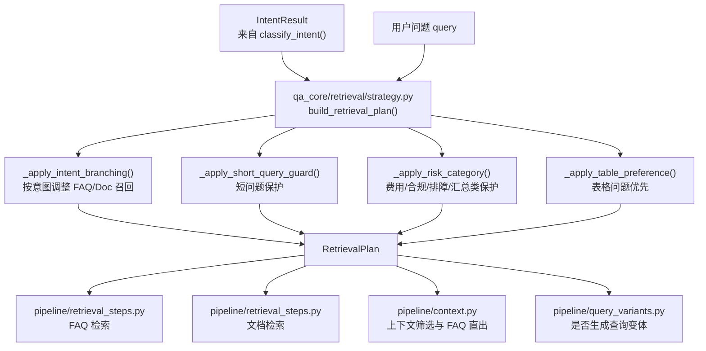
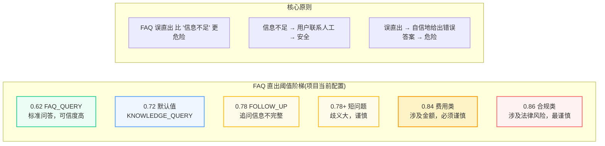
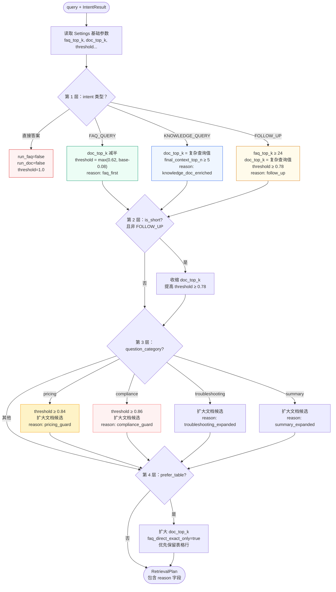
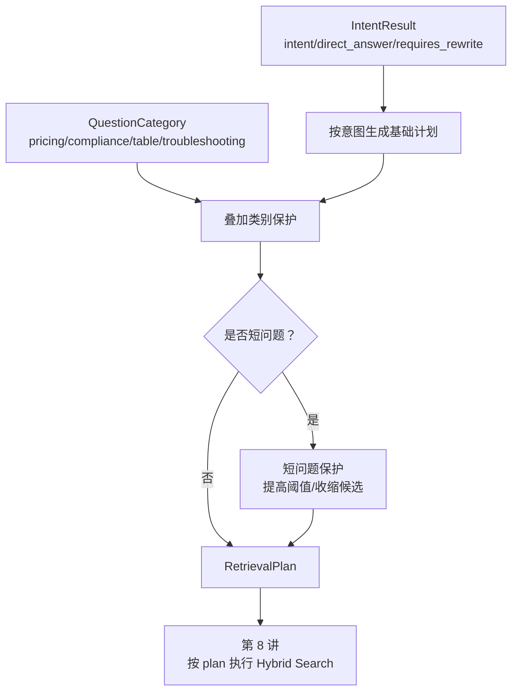
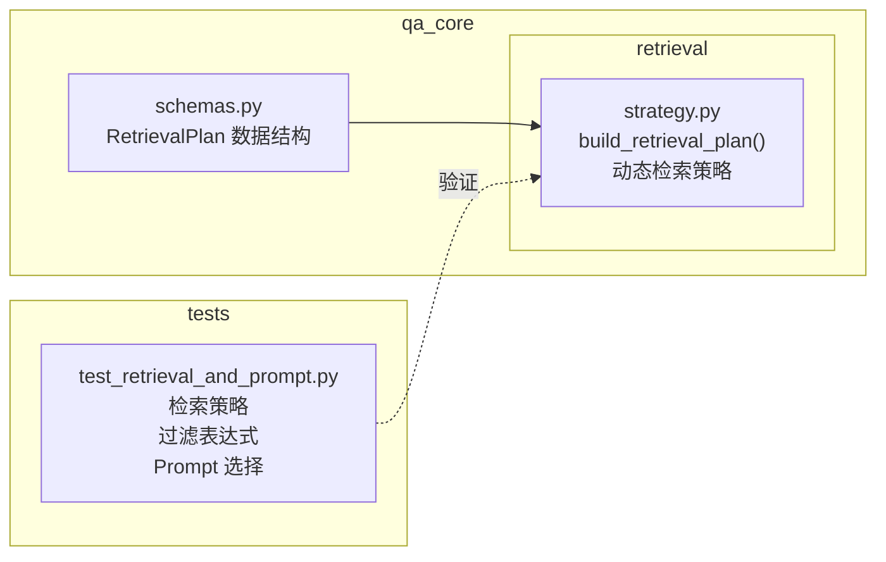

# 检索策略

<Badge icon="clock" color="green">Written: 2026.06</Badge>

> 第 06 章跟敲代码：`codealong/chapters/ch06_retrieval_strategy`。
> 这部分代码是本章跟敲版，用来先跑通核心闭环；完整项目源码仍以本讲后文标注的 `qa_core/`、`scripts/` 等路径为准。

**上一讲**：[意图分类](/RAG/pipeline/intent-classification)\
**下一讲**：[查询改写与变体生成](/RAG/retrieval/query-rewrite-variants)

## 1. 本讲目标

* 理解为什么不同问题需要不同的检索参数
* 掌握 RetrievalPlan 的完整结构和每个字段的含义
* 理解动态阈值的设计哲学
* 读懂 build\_retrieval\_plan() 的策略分支逻辑

***

## 2. 本讲项目交付闭环

第 5 讲已经把用户问题识别成 `IntentResult`。这一讲要继续往后推进一步：把“意图”转换成一份可执行的检索计划。也就是说，主流程后面不再到处写 `if intent == ...`，而是统一消费 `RetrievalPlan`。

| 项目交付项 | 说明                                                                                                                                     |
| ----- | -------------------------------------------------------------------------------------------------------------------------------------- |
| 核心模块  | `qa_core/retrieval/strategy.py`                                                                                                        |
| 核心函数  | `build_retrieval_plan()`、`_apply_intent_branching()`、`_apply_short_query_guard()`、`_apply_risk_category()`、`_apply_table_preference()` |
| 输入对象  | 第 5 讲输出的 `IntentResult`                                                                                                                |
| 输出对象  | `RetrievalPlan`                                                                                                                        |
| 下游衔接  | FAQ 检索、文档检索、FAQ 直出、上下文筛选、查询变体                                                                                                          |
| 验证入口  | `tests/test_retrieval_and_prompt.py`                                                                                                   |

本讲实现完成后的代码结构：



闭环验证方式：

```text
pytest tests/test_retrieval_and_prompt.py -q
```

验证时重点看：`FAQ_QUERY` 是否使用 FAQ 优先策略，`KNOWLEDGE_QUERY` 是否扩大文档召回，短问题是否提高保护阈值，费用/合规/表格类问题是否触发更谨慎的参数。

***

## 3. 前置知识 — 检索策略中的关键概念

### 3.1 为什么不能所有问题用一套参数

很多 RAG 教程和 Demo 会这样做：

```python
# 简单粗暴的做法(本项目避免这样做)
def simple_rag(query):
    docs = vector_store.similarity_search(query, k=5)  # 永远取 5 条
    answer = llm.invoke(f"根据以下资料回答：{docs}\n问题：{query}")
    return answer
```

这个做法的问题：

| 场景   | 问题           | 固定参数的问题                        |
| ---- | ------------ | ------------------------------ |
| FAQ  | "忘记密码怎么办"    | k=5 不够，FAQ 里最匹配的那条可能在 top-3 之外 |
| 知识咨询 | "入职流程包含哪些步骤" | k=5 可能不够，需要多段资料拼出完整流程          |
| 追问   | "那审批呢"       | 信息不完整，k=5 可能全是无关内容             |
| 合规   | "这个合同条款合法吗"  | 只看 5 条可能导致断章取义                 |
| 问候   | "你好"         | 根本不需要检索，白白消耗资源                 |

**检索策略的核心思想**：不同问题类型，用不同的检索参数。这是一个"动态计划"，而非"全局常量"。

### 3.2 关键参数概念

| 参数                     | 含义             | 调大效果       | 调小效果           |
| ---------------------- | -------------- | ---------- | -------------- |
| `faq_top_k`            | FAQ 召回条数       | 更多候选，召回更全  | 更快，减少噪音        |
| `doc_top_k`            | 文档召回条数         | 更多上下文      | 更快，减少噪音        |
| `faq_direct_threshold` | FAQ 直出分数阈值     | 更谨慎，更少直出   | 更激进，更多直出       |
| `final_context_top_n`  | 最终进 Prompt 的条数 | LLM 看到更多资料 | Prompt 更短，响应更快 |
| `min_context_score`    | 最低上下文分数        | 更宽松，更多资料   | 更严格，只保留高质量     |
| `max_context_chars`    | 上下文总字符数上限      | 更长上下文      | 更短上下文          |

***

## 4. RetrievalPlan 数据结构

```python
@dataclass(frozen=True)
class RetrievalPlan:
    """单个用户问题对应的具体检索参数。

    QAService 不直接读 settings 中的阈值，而是只消费 RetrievalPlan。
    这样调整策略时只需修改 build_retrieval_plan，不会把判断逻辑散落到主流程里。
    """

    # === 是否执行 ===
    run_faq: bool                  # 是否查 FAQ 集合
    run_doc: bool                  # 是否查文档集合

    # === 召回数量 ===
    faq_top_k: int                 # FAQ 检索候选数
    doc_top_k: int                 # 文档检索候选数

    # === 重排 ===
    rerank: bool                   # 是否对结果重排

    # === FAQ 直出控制 ===
    faq_direct_threshold: float    # 高于此分数才能直出 FAQ 答案
    faq_direct_exact_only: bool    # True=只允许精确匹配直出，禁止相似分数直出

    # === 上下文控制 ===
    final_context_top_n: int       # 最终进入 Prompt 的文档条数
    min_context_score: float       # rerank 分数低于此值的文档直接丢弃
    max_context_chars: int         # 上下文总字符数上限
    max_context_doc_chars: int     # 单条文档最大字符数

    # === 查询增强 ===
    use_query_variants: bool       # 是否生成查询变体

    # === 问题分类 ===
    question_category: str         # 问题类别(pricing/compliance/...)
    prefer_table: bool             # 是否优先保留表格行

    # === 可解释性 ===
    reason: str                    # 为什么选择这些参数
```

**`@dataclass(frozen=True)`** 的设计：检索计划一旦构建就不应被修改。它是一个确定性的决策结果，不是可变的状态。

***

## 5. build\_retrieval\_plan() 详解

### 5.1 基础参数

```python
def build_retrieval_plan(query: str, intent: IntentResult) -> RetrievalPlan:
    settings = get_settings()
    compact_query = query.strip()

    # 基础参数 — 从配置读取，以下游策略调整
    question_category = infer_question_category(compact_query)
    prefer_table = is_table_query(compact_query)
    is_short = len(compact_query) <= settings.short_query_max_chars  # 默认 12

    # 初始化为 settings 默认值，存入 params 字典
    params = {
        'run_faq': True,
        'run_doc': True,
        'faq_top_k': settings.faq_short_query_top_k if is_short else settings.faq_top_k,
        'doc_top_k': settings.doc_top_k,
        'final_context_top_n': settings.final_context_top_n,
        'direct_threshold': settings.faq_direct_score_threshold,
        'faq_direct_exact_only': False,
        'reason': 'balanced_hybrid',
    }

    # 4 层决策链，逐层调整 params
    params = _apply_intent_branching(intent, params, settings)
    params = _apply_short_query_guard(is_short, intent, params, settings)
    params = _apply_risk_category(question_category, params, settings)
    params = _apply_table_preference(prefer_table, params['run_doc'], params, settings)

    return RetrievalPlan(
        run_faq=params['run_faq'],
        run_doc=params['run_doc'],
        faq_top_k=params['faq_top_k'],
        doc_top_k=params['doc_top_k'],
        rerank=True,
        faq_direct_threshold=params['direct_threshold'],
        final_context_top_n=params['final_context_top_n'],
        min_context_score=settings.rag_min_score_threshold,
        max_context_chars=settings.max_prompt_context_chars,
        max_context_doc_chars=settings.max_context_doc_chars,
        use_query_variants=intent.intent in {"KNOWLEDGE_QUERY", "FOLLOW_UP"},
        question_category=question_category,
        prefer_table=prefer_table,
        faq_direct_exact_only=params['faq_direct_exact_only'],
        reason=params['reason'],
    )
```

上面代码中 `is_table_query()` 用于判断用户问题是否涉及表格/清单类查询(详见 [3.5 节](#35))，定义如下：

```python
# qa_core/intent/question_category.py
TABLE_QUERY_HINTS = re.compile(
    r"(表格|清单|台账|明细|字段|列名|行号|sheet|工作表|导出|列表|矩阵|评分表|检查表|对账|"
    r"材料清单|验收项|付款节点|状态|责任人|金额|数量|单价|收款账户|银行卡|发票号码|箱单|装箱单)"
)

def is_table_query(query: str) -> bool:
    """判断当前问题是否更像在查询表格、清单或台账中的某一行/某个字段。

    这个判断和 infer_question_category 不是同一层含义：
    - infer_question_category 决定 Prompt 风险模板，例如费用类走 pricing_guard；
    - is_table_query 决定检索偏好，例如"材料清单里施工照片是什么状态"应优先保留
      表格行 chunk。

    使用场景：
    - 检索计划里扩大文档候选数；
    - 上下文筛选时把 content_type=table_row 的 chunk 排在普通正文前；
    - 诊断面板展示本轮是否启用了表格行优先策略。
    """
    normalized = (query or "").strip().lower()
    return bool(TABLE_QUERY_HINTS.search(normalized))
```

**`infer_question_category()` 的实现**

上面代码中 `is_table_query()` 和 `infer_question_category()` 都定义在 `qa_core/intent/question_category.py` 中。`infer_question_category()` 通过正则匹配将问题分为五类，供检索策略和提示词模板共同使用：

```python
from typing import Literal

QuestionCategory = Literal["default", "pricing", "compliance", "troubleshooting", "summary"]

PRICING_HINTS = re.compile(
    r"(费用|价格|学费|报价|优惠|折扣|退费|退款|发票|账单|支付|开票|续费|合同金额|收费|付款|"
    r"赔付|赔款|金额|回款|预算|采购|报销|信用证|保证金|付款条件|收款账户|打款|结算|税费)"
)
COMPLIANCE_HINTS = re.compile(
    r"(合规|隐私|个人信息|客户数据|外部平台|合同|条款|审计|风险|违规|保密|权限审批|数据出境|授权|责任|"
    r"制裁|名单|出口管制|强制性|规范|标准|图纸冲突|除外|免责|不赔|拒赔|HS\s*编码|海关|报关|申报|"
    r"归类|最终用途|最终用户|尽调|受限空间|作业审批|安全确认|安全技术交底|检验批|隐蔽工程|验收|"
    r"既往症|如实告知|保单复效)"
)
TROUBLESHOOTING_HINTS = re.compile(
    r"(故障|报错|失败|无法|异常|告警|报警|排查|维修|巡检|安装|配置|连接不上|超时|错误码)"
)
SUMMARY_HINTS = re.compile(
    r"(总结|概括|归纳|整理|对比|区别|有哪些|都包括|主要内容|学习内容|大纲)"
)

def infer_question_category(query: str) -> QuestionCategory:
    """根据用户问题判断 RAG 回答风险类别。

    优先级从高到低：
    1. 费用/合同金额类——最保守，不能超知识库承诺；
    2. 合规/合同/隐私类——必须引用来源并明确未确认边界；
    3. 排障类——需要扩大文档召回并输出步骤；
    4. 总结类——需要整合更多上下文；
    5. 默认类——普通知识问答。

    使用规则而不是 LLM，是因为类别用于控制风险和检索参数，必须稳定、
    低成本、可解释。
    """
    normalized = (query or "").strip().lower()
    if PRICING_HINTS.search(normalized):
        return "pricing"
    if COMPLIANCE_HINTS.search(normalized):
        return "compliance"
    if TROUBLESHOOTING_HINTS.search(normalized):
        return "troubleshooting"
    if SUMMARY_HINTS.search(normalized):
        return "summary"
    return "default"
```

### 5.2 意图分支

**分支 1：直接答案类 — 不检索**

```python
def _apply_intent_branching(intent: IntentResult, params: dict, settings) -> dict:
    """第 1 层：按意图分岔调整检索参数。"""
    if intent.direct_answer or intent.intent in {"GREETING", "HUMAN_SERVICE", "OUT_OF_SCOPE"}:
        params['run_faq'] = False
        params['run_doc'] = False
        params['direct_threshold'] = 1.0
        params['reason'] = "direct_answer_no_retrieval"
        return params
```

**分支 2：FAQ 查询 — FAQ 优先策略**

```text
    elif intent.intent == "FAQ_QUERY":
        # 降低直出阈值：FAQ 问题的标准答案更可信，可以更"勇敢"地直出
        # 但最低不低于 0.62，防止配置过低导致误直出
        params['doc_top_k'] = max(8, settings.doc_top_k // 2)
        params['direct_threshold'] = max(0.62, settings.faq_direct_score_threshold - 0.08)
        params['reason'] = "faq_first"
```

**设计分析**：

* `doc_top_k // 2`：FAQ 问题不需要太多文档上下文，减少文档候选。这是项目策略，不是固定公式。
* `threshold - 0.08`：降低直出门槛，相信 FAQ 标准答案。`0.08` 是相对调整幅度，来自项目对 FAQ 优先策略的保守设定。
* `max(0.62, ...)`：项目保护底线，防止配置过低导致误直出。生产环境应结合误直出样本继续校准。

**分支 3：知识咨询 — 加强文档检索**

```text
    elif intent.intent == "KNOWLEDGE_QUERY":
        params['doc_top_k'] = max(settings.doc_top_k, settings.doc_complex_query_top_k)
        params['final_context_top_n'] = max(settings.final_context_top_n, 5)
        params['reason'] = "knowledge_doc_enriched"
```

**设计分析**：

* 知识咨询通常需要多段资料拼出完整答案(如入职流程需要制度、材料清单、审批步骤)
* `doc_complex_query_top_k`：项目配置项，用来给复杂问题更大的搜索空间；当前默认值以代码 `Settings` 为准。
* `final_context_top_n` 增加到 5：让 LLM 看到更多完整片段；这个值受模型上下文窗口、文档粒度和噪声率影响，需要通过评测校准。

**分支 4：追问 — 谨慎策略**

```text
    elif intent.intent == "FOLLOW_UP":
        # 追问信息不完整，即使经过改写也可能不精确
        # 提高直出阈值，防止误命中
        params['faq_top_k'] = max(settings.faq_top_k, 24)
        params['doc_top_k'] = max(settings.doc_top_k, settings.doc_complex_query_top_k)
        params['final_context_top_n'] = max(settings.final_context_top_n, 5)
        params['direct_threshold'] = max(settings.faq_direct_score_threshold, 0.78)
        params['reason'] = "history_aware_follow_up"
```

**设计分析**：

* `direct_threshold ≥ 0.78`：项目保护阈值，原则是宁可多检索也不要误直出。追问的信息不完整，FAQ 相似分数可能虚高。
* 扩大候选数：给检索更多机会找到正确内容

### 5.3 短问题保护

```python
def _apply_short_query_guard(is_short: bool, intent: IntentResult, params: dict, settings) -> dict:
    """第 2 层：短问题歧义大，收缩文档检索范围、提高 FAQ 直出门槛。"""
    if is_short and intent.intent != "FOLLOW_UP":
        params['doc_top_k'] = min(params['doc_top_k'], max(12, settings.final_context_top_n * 2))
        params['direct_threshold'] = max(0.78, params['direct_threshold'])
        params['reason'] = f"{params['reason']}_short_query_guard"
    return params
```

**设计分析**：

* 短问题(如"权限"、"发票")歧义很大
* 收缩文档检索范围，减少噪声
* 提高直出阈值，防止"权限"误匹配到 FAQ 中某个具体权限的答案
* 但排除 FOLLOW\_UP：短追问可以通过历史改写补全，不应简单按短句收缩

### 5.4 问题类别保护

以下是对特定高频、高风险问题类别的特殊策略：

**费用类 — 强口径保护**

```python
def _apply_risk_category(question_category: str, params: dict, settings) -> dict:
    """第 3 层：按风险类别收紧检索参数。"""
    if question_category == "pricing":
        params['faq_top_k'] = max(params['faq_top_k'], settings.faq_top_k)
        params['doc_top_k'] = max(params['doc_top_k'], settings.doc_complex_query_top_k)
        params['final_context_top_n'] = max(params['final_context_top_n'], 6)
        params['direct_threshold'] = max(params['direct_threshold'], 0.84)
        params['reason'] = f"{params['reason']}_pricing_guard"
        return params
```

**为什么费用类需要特殊保护**："退款多少钱"、"什么时候到账"这类问题，如果 FAQ 直出了一个相似但不准确的答案，后果很严重。策略上宁可多召回资料让模型基于上下文回答，也不能凭一个 0.75 分的 FAQ 直接承诺金额。

**合规类 — 最严格保护**

```text
    elif question_category == "compliance":
        params['doc_top_k'] = max(params['doc_top_k'], settings.doc_complex_query_top_k)
        params['final_context_top_n'] = max(params['final_context_top_n'], 6)
        params['direct_threshold'] = max(params['direct_threshold'], 0.86)
        params['reason'] = f"{params['reason']}_compliance_guard"
```

**为什么合规类阈值最高**：合规判断涉及法律风险，不能只靠 FAQ 的标准回答。需要多条款交叉验证。`0.86` 是本项目当前最高保护阈值，用来表达“高风险类别更谨慎”的策略，而不是通用行业标准。

**排障类 — 扩大搜索**

```text
    elif question_category == "troubleshooting":
        params['doc_top_k'] = max(params['doc_top_k'], settings.doc_complex_query_top_k)
        params['final_context_top_n'] = max(params['final_context_top_n'], 6)
        params['reason'] = f"{params['reason']}_troubleshooting_expanded"
```

**总结归纳类 — 多片段聚合**

```text
    elif question_category == "summary":
        params['doc_top_k'] = max(params['doc_top_k'], settings.doc_complex_query_top_k)
        params['final_context_top_n'] = max(params['final_context_top_n'], 6)
        params['reason'] = f"{params['reason']}_summary_expanded"
```

### 5.5 表格问题特殊处理

```python
def _apply_table_preference(prefer_table: bool, run_doc: bool, params: dict, settings) -> dict:
    """第 4 层：表格类问题扩大候选、关闭相似 FAQ 直出。"""
    if prefer_table and run_doc:
        params['doc_top_k'] = max(params['doc_top_k'], settings.doc_complex_query_top_k)
        params['final_context_top_n'] = max(params['final_context_top_n'], 7)
        params['faq_direct_exact_only'] = True
        params['reason'] = f"{params['reason']}_table_row_preferred"
    return params
```

**为什么表格问题要禁用相似 FAQ 直出**：

```text
用户问："验收材料清单里测试报告那一行是什么状态"
FAQ 泛化回答："验收需要提交测试报告、施工照片、检测记录"
→ 这个 FAQ 答的是"需要哪些材料"，不是"某个具体字段的值"
→ 相似分数可能不低(都含"验收""测试报告")，但答非所问
→ 所以只允许精确匹配的 FAQ 直出，相似直出必须走文档 RAG
```

`prefer_table` 标志还会影响后续的上下文选择逻辑：在同等分数下，优先保留表格行而非普通文本段落。

***

## 6. 动态阈值的设计哲学

### 6.1 项目当前阈值阶梯



| 场景               | 项目当前最低阈值    | 原因                |
| ---------------- | ----------- | ----------------- |
| FAQ\_QUERY       | 0.62        | FAQ 标准答案可信，可以相对宽松 |
| KNOWLEDGE\_QUERY | 0.72(配置默认值) | 基线阈值              |
| FOLLOW\_UP       | 0.78        | 追问信息不完整，更谨慎       |
| 短问题              | 0.78+       | 歧义大，更谨慎           |
| 费用类              | 0.84        | 涉及金额，更谨慎          |
| 合规类              | 0.86        | 涉及法律风险，最谨慎        |

这些数字不是行业标准，也不是模型自动学习出来的结果，而是本项目当前的策略参数。解释时重点讲“为什么不同场景要分层”，不要把 `0.62/0.78/0.86` 讲成放之四海皆准的阈值。上线前要用 FAQ 误直出率、insufficient\_context 比例、人工评测集和 LangSmith Evaluation 继续校准。

### 6.2 一个贯穿始终的原则

**FAQ 误直出比"信息不足"更危险。**

* **信息不足** → 提示用户联系人工客服 → 用户知道系统不能确定答案
* **FAQ 误直出** → 系统自信地给出错误信息 → 用户被误导 → 可能产生严重后果

这就是为什么在费用、合规、追问等场景下宁可提高阈值也不降低的原因。

### 6.3 Reason 字段的意义

每个策略分支都有一个 `reason` 字符串，它会写入 LangSmith trace，并在必要时用于本地排查：

```text
# 举例
reason = "faq_first_short_query_guard_pricing_guard"
# 解读：这是一个 FAQ 倾向的问题，但因为是短问题+费用类，整体阈值提高了
```

这保证了**可解释性**：后续排查 bad case 时，可以直接看到这个请求为什么走了某套参数，而不是猜测。

***

## 7. 检索计划与下游的衔接

### 7.1 build\_retrieval\_plan() 完整决策流程



### 7.2 在 RAG 流程中的使用

上面流程图展示了 `build_retrieval_plan()` 内部的 4 层决策。但读者容易困惑的是：**`RetrievalPlan` 创建出来后，到底是怎么被下游函数消费的？** 下面逐段展示代码中的实际衔接点。

**Step 1 — plan 的创建：`prepare_retrieval()`**

```python
# qa_core/pipeline/steps.py — prepare_retrieval()
# 这一步先完成检索类意图识别和按需查询改写，再调用 build_retrieval_plan() 创建 plan，
# 然后连同 source、查询变体等参数一起打包到 RetrievalPreparation 对象中。

def prepare_retrieval(context):
    ...
    intent = classify_intent(query, history, scenario)          # 意图识别
    rewritten = rewrite_query_if_needed(query, history, ...)    # 按需查询改写

    # ★ plan 在此创建 — 对应上方流程图的第 1~4 层决策
    plan = build_retrieval_plan(rewritten, intent)

    # plan.use_query_variants 控制是否生成同义检索表达
    variants = generate_query_variants(rewritten, enabled=plan.use_query_variants)

    # 返回的统一参数包，后续所有步骤只读不写
    return RetrievalPreparation(
        intent=intent,
        rewritten_query=rewritten,
        plan=plan,              # ★ 检索计划(核心)
        query_variants=variants,
        ...
    )
```

**Step 2 — plan 的消费①：`search_faq()`**

```python
# qa_core/pipeline/retrieval_steps.py — search_faq()
# FAQ 检索从 prepared.plan 中读取 3 个字段，传到 MilvusHybridStore.search_many()

def search_faq(context, prepared):
    if not prepared.plan.run_faq:          # ← 流程图 "直接答案" 分支 → False
        return RetrievalResult.empty()
    return get_faq_store(...).search_many(
        queries=prepared.query_variants,
        k=prepared.plan.faq_top_k,         # ← 流程图决定的值(默认 20，短问题/追问可调)
        rerank=prepared.plan.rerank,       # ← 始终 True，启用 CrossEncoder 重排
        ...
    )
```

**Step 3 — plan 的消费②：`get_faq_direct_answer()`**

```python
# qa_core/pipeline/retrieval_steps.py — get_faq_direct_answer()
# 从 plan 中读取阈值，判断 FAQ 检索结果是否可以直接返回。

def get_faq_direct_answer(context, prepared, faq_result):
    # faq_direct_exact_only 来自流程图的 prefer_table 分支 → True
    # faq_direct_threshold 来自流程图的 FAQ_QUERY(0.62~)/pricing(0.84)/compliance(0.86) 分支
    threshold = (
        float("inf")  # ← 只允许精确匹配(表格类问题)
        if prepared.plan.faq_direct_exact_only
        else prepared.plan.faq_direct_threshold
    )
    return direct_faq_answer(query, faq_result.top_document, score, threshold)
```

**`direct_faq_answer()` 的实现**

被调用的 `direct_faq_answer()` 定义在 `qa_core/pipeline/context.py` 中，判断 FAQ 结果是否可以不经过 LLM 直接返回标准答案。只允许两种情况：

1. 用户问题和 FAQ 标准问题完全一致；
2. 检索/重排分数达到当前 `RetrievalPlan` 给出的动态阈值。

FAQ 答案通常是费用、流程、账号、合同等强口径内容，直出可以减少幻觉，但相似问题误直出风险很高，不能只要召回就返回。

```text
def direct_faq_answer(
    original_query: str, doc: Document | None, score: float, threshold: float
) -> str | None:
    """判断 FAQ 是否可以不经过 LLM 直接返回标准答案。"""
    if doc is None:
        return None
    metadata = doc.metadata or {}
    answer = str(metadata.get("answer") or "").strip()
    standard_question = str(
        metadata.get("standard_question") or doc.page_content
    ).strip()
    if not answer:
        return None
    if original_query.strip() == standard_question:
        return answer
    if score >= threshold:
        return answer
    return None
```

**Step 4 — plan 的消费③：`select_context_docs()`**

```python
# qa_core/pipeline/context.py — select_context_docs()
# 这是 plan 被消费得最密集的地方，5 个字段同时生效。

def select_context_docs(faq_hits, doc_hits, plan):
    for hit in faq_hits:
        if hit.score < plan.min_context_score:     # ← 过滤低分命中
            continue
        if len(selected) >= plan.final_context_top_n:  # ← 条数上限
            break
        if len(content) > plan.max_context_doc_chars:  # ← 单条截断
            content = content[:plan.max_context_doc_chars]
        if total_chars + len(content) > plan.max_context_chars:  # ← 总量上限
            break
        selected.append(...)

    if plan.prefer_table:  # ← 表格类问题：表格行排到普通正文前
        doc_hits = sorted(doc_hits, key=lambda h: (
            0 if is_table_document(h.document) else 1, -h.score
        ))
    ...
```

**数据流总结 — 从流程图到代码的定位指引：**

| 流程图分支         | 产生的 plan 字段                                   | 下游消费函数路径                                                                                   |
| ------------- | --------------------------------------------- | ------------------------------------------------------------------------------------------ |
| 直接答案          | `run_faq=False, run_doc=False`                | `qa_core/pipeline/retrieval_steps.py::search_faq()`、`search_doc()`                         |
| FAQ\_QUERY    | `faq_direct_threshold = max(0.62, base-0.08)` | `qa_core/pipeline/retrieval_steps.py::get_faq_direct_answer()`                             |
| FOLLOW\_UP    | `faq_top_k ≥ 24, threshold ≥ 0.78`            | `qa_core/pipeline/retrieval_steps.py::search_faq()`、`get_faq_direct_answer()`              |
| pricing 类别    | `threshold ≥ 0.84, final_context_top_n ≥ 6`   | `qa_core/pipeline/retrieval_steps.py`、`qa_core/pipeline/context.py::select_context_docs()` |
| compliance 类别 | `threshold ≥ 0.86, final_context_top_n ≥ 6`   | `qa_core/pipeline/retrieval_steps.py`、`qa_core/pipeline/context.py::select_context_docs()` |
| prefer\_table | `faq_direct_exact_only=True, doc_top_k 扩大`    | `qa_core/pipeline/retrieval_steps.py`、`qa_core/pipeline/context.py::select_context_docs()` |
| 所有分支          | `use_query_variants`                          | `qa_core/pipeline/query_variants.py::generate_query_variants()`                            |
| 所有分支          | `reason`                                      | `qa_core/pipeline/steps.py` → `retrieval_info` → LangSmith trace                           |

### 7.3 FAQ Store 和 Doc Store 的工厂模式

```python
# qa_core/retrieval/factory.py
from functools import lru_cache

# 真正的缓存发生在 get_hybrid_store 级别。collection 连接是重量级对象，
# 只需按 collection_name 缓存一次即可复用。
@lru_cache(maxsize=32)
def get_hybrid_store(collection_name: str) -> MilvusHybridStore:
    """按 collection_name 返回已缓存的 Milvus 混合检索封装。"""
    return MilvusHybridStore(collection_name)

def get_faq_store(collection_name: str | None = None) -> MilvusHybridStore:
    """返回已缓存的 FAQ 集合封装。

    不直接带 @lru_cache：当 collection_name 为 None 时会回落为当前
    active 场景的默认 FAQ collection，该默认值可能在运行时变化。
    真正的连接复用交给 get_hybrid_store 处理。
    """
    return get_hybrid_store(collection_name or _active_scenario_collection("faq"))

def get_doc_store(collection_name: str | None = None) -> MilvusHybridStore:
    """返回已缓存的文档集合封装。"""
    return get_hybrid_store(collection_name or _active_scenario_collection("doc"))
```

> **注意**：缓存(`@lru_cache`)位于 `get_hybrid_store` 而非 `get_faq_store` / `get_doc_store` 上。两个高层函数接收可选的 `collection_name` 参数(而非 `scenario_id`)，在未指定时自动回落为当前 active 场景的默认 collection。这样设计使得缓存 key 始终是 `collection_name` 字符串，避免了因 scenario 元数据变化导致的缓存膨胀；同时 `get_faq_store` / `get_doc_store` 本身保持无状态，便于在运行时切换默认场景。

***

## 8. 本讲实践闭环

| 项目       | 内容                                                |
| -------- | ------------------------------------------------- |
| 本讲类型     | 项目实现                                              |
| 实践产物     | `qa_core/retrieval/strategy.py` 与 `RetrievalPlan` |
| 是否进入最终项目 | 是                                                 |
| 验收方式     | 运行检索策略单测，验证不同意图和问题类别生成不同参数                        |
| 后续落点     | 第 8 讲按 plan 检索，第 10 讲由 Pipeline 调用                |

通过标准：FAQ、文档、表格、追问等问题能得到不同 `top_k`、阈值、是否 rerank、是否 query variants 的计划。

### 8.1 本讲从 0 到 1 实现闭环

本讲承接第 5 讲的 `IntentResult`，把“用户是什么问题”转换成“应该怎么检索”。它不直接查 Milvus，只负责生成检索计划。



实现完成后，相关代码结构应该是下面这张图：



#### 8.1.1 ：定义检索计划结构

目标：把“怎么检索”变成一个可传递、可测试、可追踪的数据对象。

来源：真实代码节选，见 `qa_core/schemas.py` 中的 `RetrievalPlan`。

```python
@dataclass(frozen=True)
class RetrievalPlan:
    run_faq: bool = True
    run_doc: bool = True
    faq_top_k: int = 8
    doc_top_k: int = 12
    rerank: bool = True
    use_query_variants: bool = False
    faq_direct_threshold: float = 0.72
    final_context_top_n: int = 5
    reason: str = "default"
```

设计解释：Pipeline 不应该到处散落 `top_k=8` 这类魔法数字，而是先得到一个计划，再按计划检索。

#### 8.1.2 ：实现 6 步动态检索计划

目标：把真实代码里的 6 步决策完整讲清楚，而不是只展示几个意图分支。

来源：真实代码逻辑压缩版，对应 `qa_core/retrieval/strategy.py::build_retrieval_plan()`。

```python
def build_retrieval_plan(query: str, intent: IntentResult) -> RetrievalPlan:
    settings = get_settings()
    compact_query = query.strip()

    # 第 1 步：识别问题形态
    question_category = infer_question_category(compact_query)
    prefer_table = is_table_query(compact_query)
    is_short = len(compact_query) <= settings.short_query_max_chars

    # 第 2 步：以 settings 为基线初始化参数
    params = {
        "run_faq": True,
        "run_doc": True,
        "faq_top_k": settings.faq_short_query_top_k if is_short else settings.faq_top_k,
        "doc_top_k": settings.doc_top_k,
        "final_context_top_n": settings.final_context_top_n,
        "direct_threshold": settings.faq_direct_score_threshold,
        "faq_direct_exact_only": False,
        "reason": "balanced_hybrid",
    }

    # 第 3-6 步：逐层叠加策略
    params = _apply_intent_branching(intent, params, settings)
    params = _apply_short_query_guard(is_short, intent, params, settings)
    params = _apply_risk_category(question_category, params, settings)
    params = _apply_table_preference(prefer_table, params["run_doc"], params, settings)

    return RetrievalPlan(
        run_faq=params["run_faq"],
        run_doc=params["run_doc"],
        faq_top_k=params["faq_top_k"],
        doc_top_k=params["doc_top_k"],
        rerank=True,
        faq_direct_threshold=params["direct_threshold"],
        final_context_top_n=params["final_context_top_n"],
        min_context_score=settings.rag_min_score_threshold,
        max_context_chars=settings.max_prompt_context_chars,
        max_context_doc_chars=settings.max_context_doc_chars,
        use_query_variants=intent.intent in {"KNOWLEDGE_QUERY", "FOLLOW_UP"},
        question_category=question_category,
        prefer_table=prefer_table,
        faq_direct_exact_only=params["faq_direct_exact_only"],
        reason=params["reason"],
    )
```

设计解释：真实实现不是一次性返回某个固定 `RetrievalPlan`，而是从 settings 基线出发，按“意图 → 短问题 → 风险类别 → 表格偏好”逐层叠加，最后组装不可变计划。

#### 8.1.3 ：理解四个决策层的完整分支

目标：知道每个 helper 到底改变了哪些字段。

来源：真实代码逻辑压缩版，对应 `qa_core/retrieval/strategy.py::_apply_intent_branching()`、`_apply_short_query_guard()`、`_apply_risk_category()`、`_apply_table_preference()`。

```text
# 第 1 层：意图分支
if intent.direct_answer or intent.intent in {"GREETING", "HUMAN_SERVICE", "OUT_OF_SCOPE"}:
    run_faq = run_doc = False
    direct_threshold = 1.0
elif intent.intent == "FAQ_QUERY":
    doc_top_k = max(8, settings.doc_top_k // 2)
    direct_threshold = max(0.62, settings.faq_direct_score_threshold - 0.08)
elif intent.intent == "KNOWLEDGE_QUERY":
    doc_top_k = max(settings.doc_top_k, settings.doc_complex_query_top_k)
    final_context_top_n = max(settings.final_context_top_n, 5)
elif intent.intent == "FOLLOW_UP":
    faq_top_k = max(settings.faq_top_k, 24)
    doc_top_k = max(settings.doc_top_k, settings.doc_complex_query_top_k)
    direct_threshold = max(settings.faq_direct_score_threshold, 0.78)

# 第 2 层：短问题保护，FOLLOW_UP 豁免
if is_short and intent.intent != "FOLLOW_UP":
    doc_top_k = min(doc_top_k, max(12, settings.final_context_top_n * 2))
    direct_threshold = max(0.78, direct_threshold)

# 第 3 层：风险类别
if question_category == "pricing":
    faq_top_k = max(faq_top_k, settings.faq_top_k)
    doc_top_k = max(doc_top_k, settings.doc_complex_query_top_k)
    final_context_top_n = max(final_context_top_n, 6)
    direct_threshold = max(direct_threshold, 0.84)
elif question_category == "compliance":
    doc_top_k = max(doc_top_k, settings.doc_complex_query_top_k)
    final_context_top_n = max(final_context_top_n, 6)
    direct_threshold = max(direct_threshold, 0.86)
elif question_category in {"troubleshooting", "summary"}:
    doc_top_k = max(doc_top_k, settings.doc_complex_query_top_k)
    final_context_top_n = max(final_context_top_n, 6)

# 第 4 层：表格偏好
if prefer_table and run_doc:
    doc_top_k = max(doc_top_k, settings.doc_complex_query_top_k)
    final_context_top_n = max(final_context_top_n, 7)
    faq_direct_exact_only = True
```

设计解释：高风险问题宁可信息不足，也不能因为相似 FAQ 误直出；表格问题还会打开 `faq_direct_exact_only`，避免“看起来相似”的 FAQ 抢答具体行列数据。

#### 8.1.4 ：写测试验证动态参数

验收命令：

来源：命令行验收，对应 `tests/test_retrieval_and_prompt.py`。

```bash
python -m pytest tests/test_retrieval_and_prompt.py -q
```

闭环验证重点：

| 验证项    | 输入条件                            | 期望结果                                           |
| ------ | ------------------------------- | ---------------------------------------------- |
| 直接答案   | `IntentResult.direct_answer` 有值 | `run_faq=False`，`run_doc=False`                |
| FAQ 优先 | `intent=FAQ_QUERY`              | FAQ 阈值较低，允许高置信 FAQ 直出                          |
| 知识咨询   | `intent=KNOWLEDGE_QUERY`        | 扩大文档候选，保留 rerank                               |
| 追问     | `intent=FOLLOW_UP`              | 启用 query variants 或提高直出阈值                      |
| 短问题保护  | 非追问短句                           | 收缩 `doc_top_k`，提高阈值                            |
| 费用类    | `question_category=pricing`     | 扩大候选，阈值至少 0.84                                 |
| 合规类    | `question_category=compliance`  | 阈值至少 0.86                                      |
| 排障/总结  | `troubleshooting/summary`       | 扩大文档候选和上下文数量                                   |
| 表格问题   | `prefer_table=True`             | 扩大 `doc_top_k`，设置 `faq_direct_exact_only=True` |
| 计划组装   | 任意非直接问题                         | 包含 min/max context、category、reason 等完整字段       |

通过标准：

* FAQ 问题和知识咨询问题生成不同 `faq_direct_threshold`。
* 追问启用 `use_query_variants` 或提高阈值。
* 表格类问题扩大文档候选，并避免相似 FAQ 误直出。
* `reason` 能表达策略叠加过程，方便 Trace 排查。

## 9. 重点掌握

| 优先级    | 内容                                                                                                                                                 | 原因                   |
| ------ | -------------------------------------------------------------------------------------------------------------------------------------------------- | -------------------- |
| ★★★ 必会 | RetrievalPlan 的完整结构和每个字段的含义(run\_faq/run\_doc、faq\_top\_k/doc\_top\_k、rerank、faq\_direct\_threshold、final\_context\_top\_n、use\_query\_variants 等) | 检索计划是整个 RAG 策略的数据核心  |
| ★★★ 必会 | build\_retrieval\_plan() 的四层决策链：意图分支 → 短问题保护 → 问题类别保护 → 表格偏好                                                                                       | 理解动态检索策略如何逐层叠加       |
| ★★★ 必会 | 动态阈值设计哲学：FAQ\_QUERY(0.62) → KNOWLEDGE\_QUERY(0.72) → FOLLOW\_UP(0.78) → 费用类(0.84) → 合规类(0.86)，FAQ 误直出比信息不足更危险                                      | 面试高频，理解"宁可不说也不乱说"的原则 |
| ★★ 理解  | 意图分支的四种策略：直接答案(不检索)、FAQ 优先(doc\_top\_k 减半)、知识咨询(扩大文档)、追问(提高阈值)                                                                                     | 意图到检索参数的映射逻辑         |
| ★★ 理解  | 短问题保护(\_apply\_short\_query\_guard)：歧义大的短问题收缩检索范围、提高阈值                                                                                             | 防误判的重要保护机制           |
| ★★ 理解  | 问题类别保护：费用类(0.84)需确认金额、合规类(0.86)不能自行判断、排障类扩大搜索                                                                                                      | 高风险场景的特殊处理           |
| ★ 了解   | reason 字段的可解释性设计(如 "faq\_first\_short\_query\_guard\_pricing\_guard")                                                                              | Trace 排查时使用          |
| ★ 了解   | 表格问题(prefer\_table)时禁用相似 FAQ 直出                                                                                                                    | 边缘场景的保护策略            |

## 10. 本讲小结

* **检索策略不是全局常量**，是根据意图、问题类别、问题长度动态生成的 RetrievalPlan
* **六个意图**对应不同的检索参数：直接答案不检索、FAQ 优先低阈值、知识咨询扩大文档、追问提高阈值
* **问题类别保护**：费用类(0.84)、合规类(0.86) — FAQ 误直出比信息不足更危险
* **短问题保护**：歧义大的短问题提高阈值、收缩文档检索，但排除可通过历史改写的追问
* **表格问题**：扩大文档候选，禁用相似 FAQ 直出，优先保留表格行
* **动态阈值**的每一档都有原因，体现在 `reason` 字段中

**下一讲**：[查询改写与变体生成](/RAG/retrieval/query-rewrite-variants) — 追问改写、查询扩展、多轮对话历史管理
