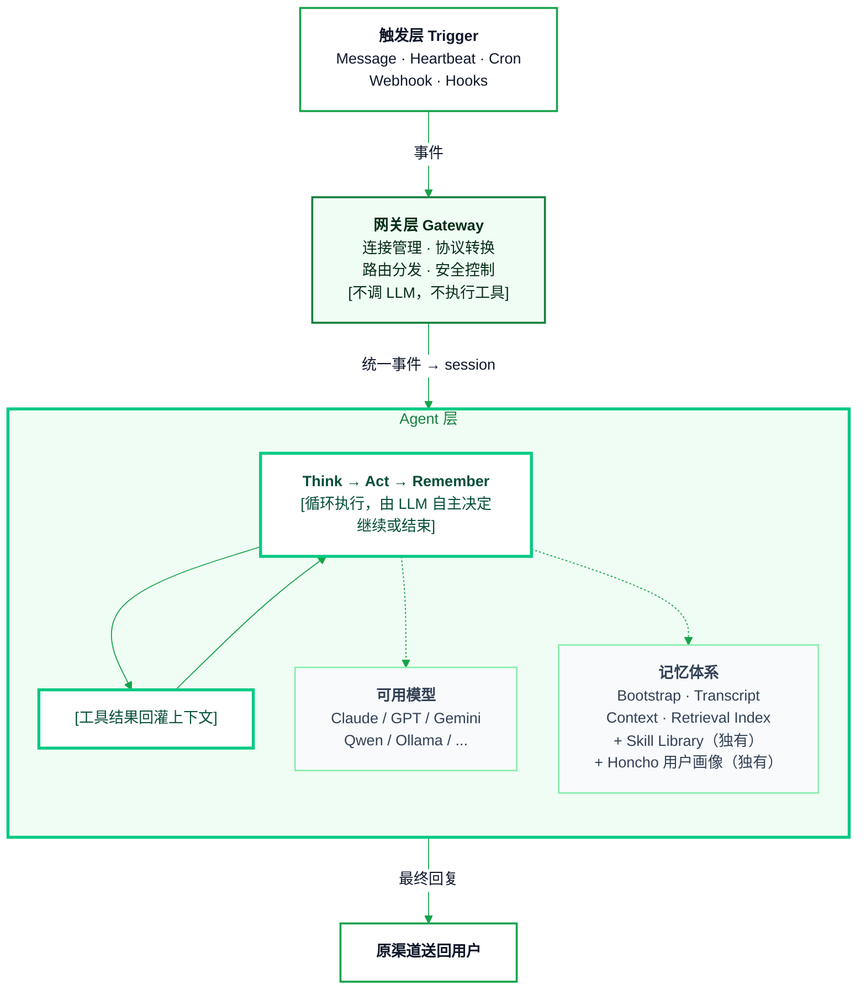
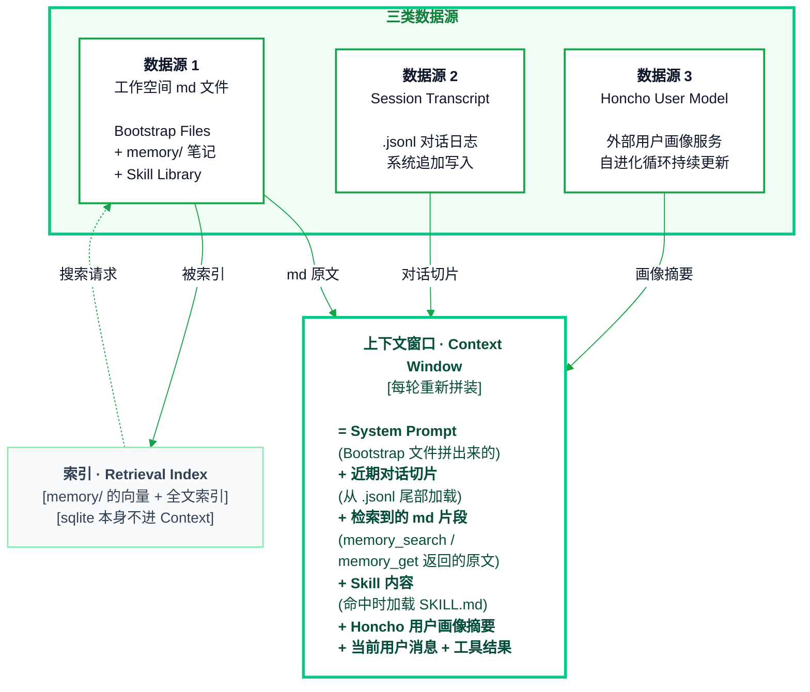
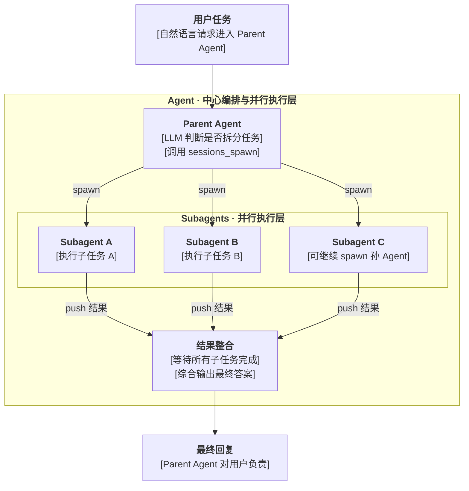
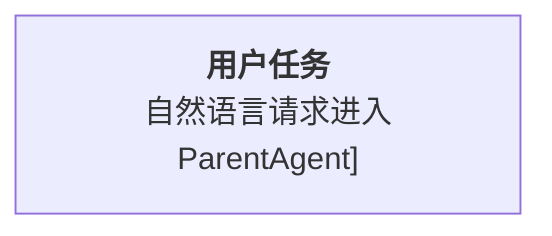
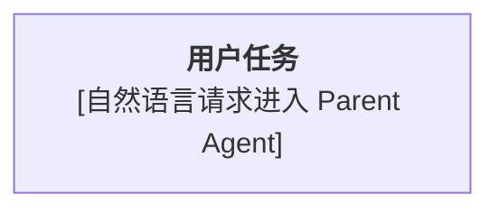

# VectorPeak Mermaid Reference

## Visual Rules

* Match VectorPeak light-mode docs: white page, restrained green accents, clear text, minimal decoration
* Use green borders for structure and pale-green fills for grouped domains
* Emphasize the core execution layer with stronger border width, not heavy dark fills
* Keep helper nodes quieter with `#F8FAFC` fill and soft green border
* Avoid dark terminal-style blocks unless the user explicitly requests dark mode
* Avoid too many colors; use green as the brand signal and slate for readable text

## Base Theme

Use this `init` block for most diagrams:

```mermaid
%%{init: {
  "theme": "base",
  "flowchart": {
    "curve": "basis",
    "htmlLabels": true,
    "nodeSpacing": 42,
    "rankSpacing": 64,
    "padding": 18
  },
  "themeVariables": {
    "background": "#FFFFFF",
    "mainBkg": "#FFFFFF",
    "primaryColor": "#FFFFFF",
    "primaryTextColor": "#0F172A",
    "primaryBorderColor": "#16A34A",
    "lineColor": "#16A34A",
    "clusterBkg": "#F0FDF4",
    "clusterBorder": "#07C983",
    "fontFamily": "Inter, ui-sans-serif, system-ui",
    "fontSize": "15px"
  }
}}%%
```

## Reusable Classes

Append these classes after graph edges:

```mermaid
classDef entry fill:#FFFFFF,stroke:#16A34A,stroke-width:2px,color:#0F172A;
classDef gateway fill:#F0FDF4,stroke:#15803D,stroke-width:2px,color:#052E16;
classDef core fill:#FFFFFF,stroke:#07C983,stroke-width:3px,color:#064E3B;
classDef aux fill:#F8FAFC,stroke:#86EFAC,stroke-width:1.5px,color:#334155;
classDef output fill:#FFFFFF,stroke:#16A34A,stroke-width:2px,color:#0F172A;
```

Use `style AgentLayer fill:#F0FDF4,stroke:#07C983,stroke-width:3px,color:#15803D` for the most important container

## Few-Shot: Standard Output

Prefer this normalized style:



## Few-Shot Notes

* Good: `<b>触发层 Trigger</b>` inside node labels
* Good: `[不调 LLM，不执行工具]` when the user wants compact inline emphasis
* Good: manual line breaks such as `连接管理 · 协议转换<br/>路由分发 · 安全控制`
* Good: keep node titles centered, then left-align dense list bodies with `<div style='text-align:left'>...</div>`
* Good: bold the main list items, then put explanatory detail on the next line in parentheses
* Avoid: `subgraph AgentLayer["**Agent 层**"]`; use `subgraph AgentLayer["Agent 层"]`
* Avoid: overly long single-line labels; split with `<br/>`

## Few-Shot: Dense Node With Left-Aligned Body

Use this pattern when a single node contains a title plus many parallel components. Keep the title centered, then left-align the dense body so the reader can scan the list vertically:



## Few-Shot: Bracketed Layer Labels

Use this pattern after finishing a Mermaid graph when each node has a title plus one or more explanatory layers. The title layer stays unwrapped. Every later text layer split by `<br/>` is wrapped in `[]`. Subgraph titles may be bold. Edge labels stay unwrapped.

Good:



Bad:



Corrected:



## Escaping

* Wrap labels in double quotes: `A["文本"]`
* Escape literal brackets in labels only when Mermaid parsing fails:
  * `[` -> `&#91;`
  * `]` -> `&#93;`
* Parentheses are usually safe inside quoted labels; if Mintlify/Mermaid parsing fails, replace:
  * `(` -> `&#40;`
  * `)` -> `&#41;`
* Use `<br/>` for new lines inside node labels
* Avoid unquoted `A[文本(说明)]` when labels contain Chinese punctuation or parentheses
